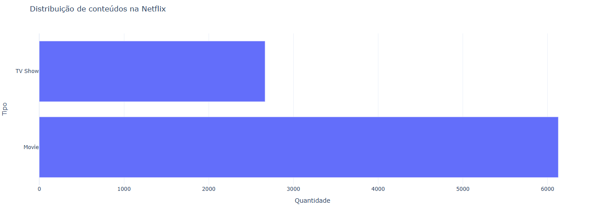
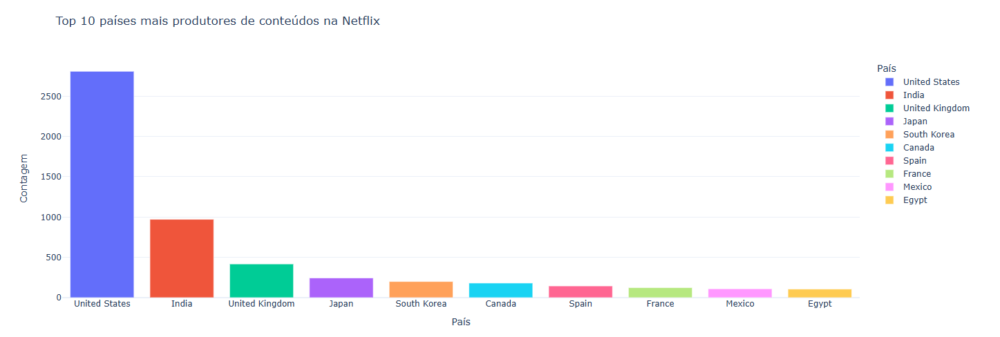
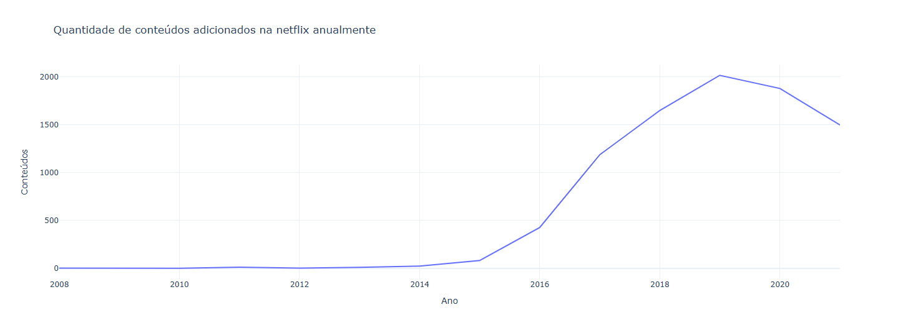
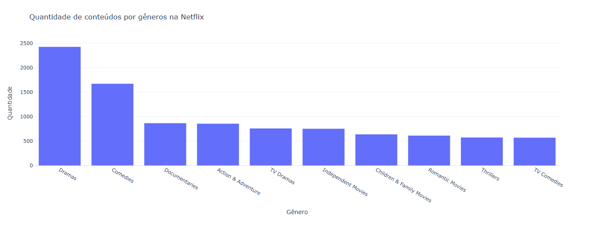
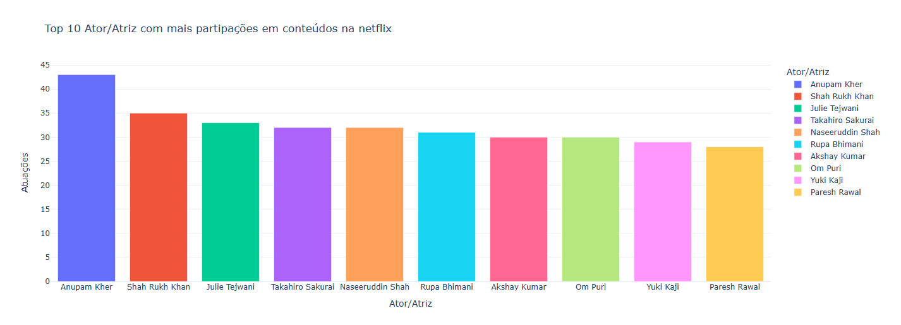

# Análise de Dados - Netflix

## Descrição do Projeto

Este projeto realiza uma análise exploratória detalhada do conjunto de dados "Netflix Movies and TV Shows", que contém informações sobre todos os filmes e séries disponíveis na plataforma Netflix. A análise abrange diversos aspectos do catálogo, incluindo distribuição de conteúdo, países produtores, evolução temporal, gêneros e participações de atores.

## Sobre o Dataset

O conjunto de dados utilizado é tabulado e contém informações completas sobre o catálogo da Netflix, incluindo:

- Título
- Diretor
- Elenco
- País de produção
- Data de adição ao catálogo
- Ano de lançamento
- Classificação
- Duração
- Gênero
- Tipo (Filme ou Série)

## Análises Realizadas

O projeto apresenta as seguintes análises:

1. **Distribuição de Conteúdo**: Análise da proporção entre filmes e séries no catálogo



2. **Top 10 Países Produtores**: Identificação dos países que mais contribuem com conteúdo para a plataforma



3. **Conteúdos Adicionados por Ano**: Evolução temporal da adição de novos conteúdos ao catálogo



4. **Principais Gêneros**: Análise dos gêneros mais populares na plataforma



5. **Ator/Atriz com Mais Participações**: Ranking dos profissionais com maior número de participações em conteúdos



## Tecnologias Utilizadas

- **Python 3.10+**: Linguagem de programação principal
- **Pandas**: Manipulação e análise de dados
- **Plotly**: Criação de visualizações interativas
- **Jupyter Notebook**: Ambiente de desenvolvimento interativo
- **Matplotlib**: Visualizações complementares

## Pré-requisitos

- Python 3.10 ou superior
- Poetry (gerenciador de dependências)

## Instalação

1. Clone o repositório:
```bash
git clone https://github.com/Nicollaxs/Data-Analysis.git
cd Data-Analysis
```

2. Instale as dependências usando Poetry:
```bash
poetry install
```

Ou, alternativamente, usando pip:
```bash
pip install pandas jupyter matplotlib plotly
```

## Como Executar

1. Ative o ambiente virtual (se estiver usando Poetry):
```bash
poetry env activate
```

2. Inicie o Jupyter Notebook:
```bash
jupyter notebook
```

3. Abra o arquivo `analise.ipynb` no navegador

4. Execute as células sequencialmente para reproduzir as análises
